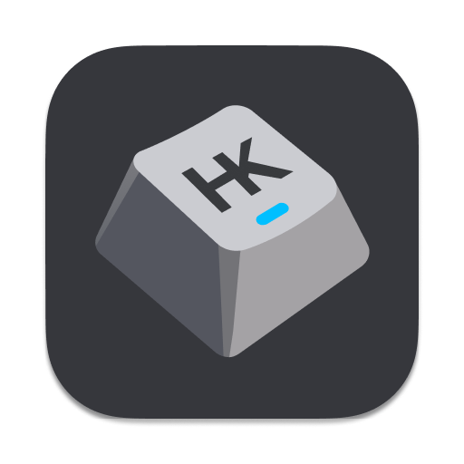

<p align="left">
  
</p>

# HyperKey

HyperKey is a minimal macOS menu bar app that turns Caps Lock into a dual-purpose key:

- Hold Caps Lock to use it as Hyper (Command + Shift + Control + Option).
- Tap Caps Lock to send F19.
- Use Hyper + H/J/K/L as arrow keys.

## Requirements

- macOS 13 or later
- Accessibility permission

## Download

Grab the latest release from [GitHub Releases](https://github.com/tehjones/hyperkey/releases/latest), unzip, and move `HyperKey.app` to `/Applications`. On first launch, right-click the app and choose **Open** — it is ad-hoc signed, so Gatekeeper will warn.

## Build

```sh
./bundle.sh
cp -R HyperKey.app /Applications/
open /Applications/HyperKey.app
```

By default, the bundle is signed ad hoc, so macOS may ask for Accessibility
permission again after a changed build. To preserve the permission, sign with a
stable identity:

```sh
HYPERKEY_SIGNING_IDENTITY="Apple Development: Your Name" ./bundle.sh
```

Open HyperKey and grant Accessibility access when macOS prompts you. You can then enable launch at login from the menu bar.

HyperKey remaps Caps Lock to F19 with `hidutil` while it is active. When HyperKey quits, it restores the Caps Lock mapping that was in place before it started.

## Sponsors

- **EzTranslate** — [翻譯拍照](https://eztranslate.com.tw/)，快速又精準
- [**Epub Translator**](https://epubtranslator.net/) — Translate complete EPUB books online

## License

[MIT](LICENSE)
